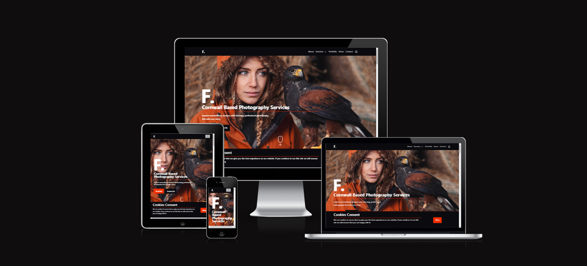
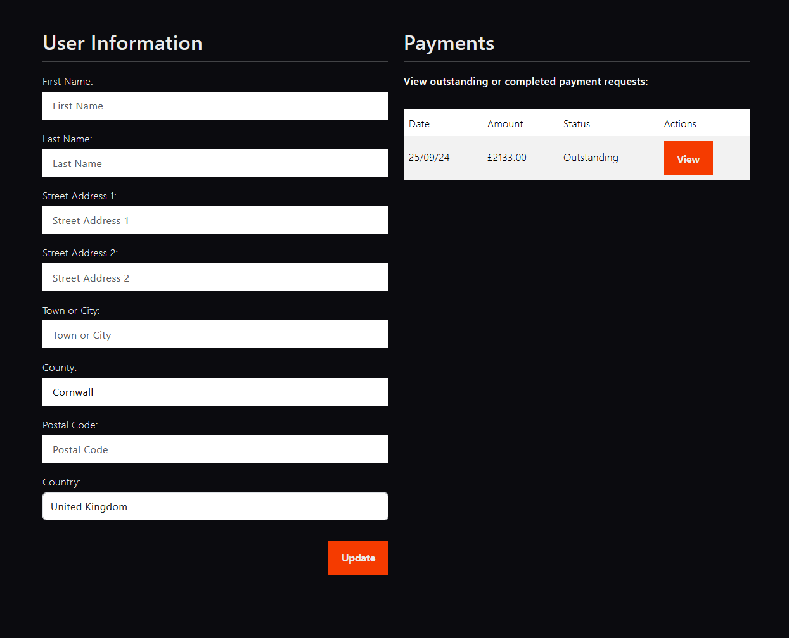

# FStops Professional Photography Services

> We do this
> Not because it is easy
> but because we thought
> it would be easy
> -- <cite>Unknown</cite>



[**Link to the live website**](https://www.fstops.co.uk)

# Project Overview

FStops Photography is a website for a freelance professional photographer. The website allows for superusers to manage and edit the content of the website using the bespoke content management system built to replace the django default admin area.

In addition to the  bespoke content management system, superusers are also able to generate invoices that can be sent to clients and then settled through the clients profile page on the website using Stripe as the payment processor. A special area in content management system allows superusers to now only create invoices, but also view the status of all previously generated invoices.

Finally, the websites contact page also allows users, whether they are signed in or not to submit messages to the site superusers. These messages are then stored in the database and can be viewed and deleted by the superusers.

FStops Photography is my fourth project in the Code Institutes level 5 Diploma in Web Application Development (Full Stack Software Development) accredited by East Kent College.

## Table of Contents

- [User Experience](#user-experience)
  - [Strategy Plane](#strategy-plane)
    - [Project Goals](#project-goals)
        - [Problems We Are Trying to Solve](#problems-we-are-trying-to-solve)
        - [Internal Stakeholders' Goals](#internal-stakeholders-goals)
        - [Business Model](#business-model)
        - [Product Goals](#product-goals)
        - [User Research](#user-research)
          - [Discovery Phase](#discovery-phase)
          - [Product Launch - Alpha Testing](#product-launch---alpha-testing)
          - [Product Launch - Beta Testing](#product-launch---beta-testing)
  - [Scope Plane](#scope-plane)
    - [Feature Planning](#feature-planning)
    - [Integrating Content Strategy and SEO](#integrating-content-strategy-and-seo)
    - [User Stories](#user-stories)
  - [Structure Plane](#structure-plane)
      - [User Flow Diagram](#user-flow-diagram)
    -  [Information Architecture](#information-architecture)
      - [Site Map](#site-map)
    - [Database Design](#database-design)
    - [Skeleton Plane](#skeleton-plane)
      - [Wireframes](#wireframes)
    - [Surface Plane](#surface-plane)
      - [Typography](#typography)
      - [Colour Palette](#colour-palette)
      - [Imagery](#imagery)
- [Features](#features)
- [Future Development, Iteration and Implementation](#future-development-iteration-and-implementation)
- [Technologies Used](#technologies-used)
  - [Languages Used](#languages-used)
  - [Frameworks Used](#frameworks-used)
  - [Databases Used](#databases-used)
  - [Libraries and Packages Used](#libraries-and-packages-used)
  - [Programmes and Applications Used](#programmes-and-applications-used)
  - [Payment Processing Platform Used](#payment-processing-platform-used)
  - [Cloud Application Platforms Used](#cloud-application-platforms-used)
  - [Cloud Storage Services Used](#cloud-storage-services-used)
- [Testing](#testing)
  - [Bugs, Issues and Solutions](#bugs-issues-and-solutions)
  - [Deployment and Local Development](#deployment-and-local-development)
  - [Credits](#credits)
  - [Acknowledgements](#acknowledgements)

  

# User Experience

## Strategy Plane

The goal of this website is to allow FStops Photography to showcase their portfolio and services in an elegant and aesthetically pleasing manner. This is to assist in the primary goal of generating leads through not only the contact form but also direct enquiries by phone or email.

Additionally, FStops Photography would also like a website in which they are able to highlight unique selling points, establish themselves as an authority in the freelance photography market and generate trust with their userbase by displaying their expertise and skills

### Project Goals

- Generate Leads - The website should encourage customers to contact FStop Photography for bookings, enquiries and consultations

- Showcase Expertise - Provide an opportunity and platform for FStops Photography to display their skills, expertise and versatility

- Increase brand visibility - Ensure the site ranks well in search results for local photography services

- Highlight Unique Selling Points - Allow the owner to highlight and distinctive elements in their customer services approach and technical ability by demonstrating their knowledge and previous work

- Collect Revenue - being able to take payments for specific amounts, whether it be a deposit or final payment. The fees charged by FStops Photography are as custom as their projects and therefore are unable to do things based on a "one size fits all" fee, therefore the amount charged for each project needs to be unique. Allowing the option to request and make payments through the website helps establish a more professional brand.

#### Problems We Are Trying to Solve

- Problem 1: FStops Photography currently has no online brand presence
  - Solution: Establish an online presence primarily by building a relevant website

- Problem 2: FStops photography currently requires cash or bank transfer for all project payments
  - Implementing a payment system through the website using Stripe establishes trust and professionalism

- Problem 3: FStops Photography currently relies purely on word of mouth for generating new leads as they has no search engine presence
  - Use search engine optimization (SEO) techniques to increase search rankings, ensuring the website appears prominently for relevant queries.

- Problem 4: The company currently has no way to communicate the available services
  -  Provide well-structured content that clearly describes each service, highlights unique offerings, and presents details or packages in an easy-to-read format.

- Problem 5: A lack of website may hint at a lack of permanence of the company and cause hesitations in clients when reaching out or booking projects
  - Establishing an online presence with real relatable customer feedback will help to build trust and a sense of professionalism

- Problem 6: No differentiation from competitors: The photography market is competitive, and FStop needs a way to stand out among other local photographers.
  - Highlight unique selling points (e.g., specialized equipment, awards, unique styles) prominently throughout the website to set FStop apart from the competition.

- Problem 7: Lead generation and conversion
  - Implement features in the website that make having an account beneficial to the end user, such as the payment system. Additionally a contact form on the website will help to encourage users to enquire about further details and availability.

- Problem 8: Users need to see the quality and versatility of FStop’s photography, but without a well-designed platform, they may not fully appreciate the talent or variety offered.
  - Solution: Create visually appealing galleries organized by category (e.g., weddings, events, portraits), featuring high-quality images to capture users' attention.

#### Internal Stakeholders' Goals

Ultimately the stakeholders goal is generate a return on investment by increasing the amounts of leads and sales they make by the presence of the website enabling additional leads generation and increased visibility via Google. There are a number of other factors that can contribute to this:

- Showcasing quality and style:
  - By showing examples of previous work and generating that "wow" response from the viewer, they are more likely to desire the services rendered by FStops Photography

- Brand Establishment:
  - Individuals and business alike are weary of cowboys who take money and disappear. Hacing a professional website show the business owner has made a significant investment into his company and is more likely to see through any projects that have been undertaken.

- SEO:
  - By establishing an online presence the company becomes more visible. An overwhelming majority of people now instantly turn to Google when they need a product or service so by becoming readily apparent in the search results you increase the likelihood of a sale.

By aligning the website design and content with these stakeholders goals I can create a website that effectively meets the expectations of the client and staisfy expectations.

#### Business Model

The business model of FStops Photography is primarily service based. Key elements of this include:

- Session Fees: Garnered for the rendering of services. A wedding shoot and associated image editing for example.
- Add ons: Generated via upsells such as prints and albums

#### Product Goals

- Reliability, quality and effectiveness as evidenced by user reviews and portfolio examples
- Client-centric approach. Again evidenced by user reviews, additional supplemental information regarding this can be established by an FAQ section

#### User Research

It is important to understand who the end user of the website would be in order to more appropriately target and connect with them. Like any business, it is crucial to understand the target market and align your goals and values with them.

The services rendered by FStops Photography are wide and varied, resulting in a similar client base including couples (wedding photography), small to medium enterprises (Product and Property photography) and young parents (Portrait photography of newborn babies). For this reason it is important to understand that the target demographic is essentially everybody.

For this reason I have opted to keep the style simple yet elegant so as to be attractive and enticing to the majority of users. You can't ever please everyone but you can still try.

The one thing all visitors have in common will be that they are looking for a freelance photographer. For this reason I will implement Google Analytics. This will allow us to closely monitor the bounce rate and most accessed webpages. In conjuction with a blog FStops Photography will be able to tailor the content on the website to best align with the needs of its users encouraging greater engagements rates.

##### Product Launch - Alpha Testing

Alpha Testing is the earliest stage of software testing carried out to identify and fixing crucial bugs in code and ensure optimal functionality of the core components of an application before it is roled out to a wider audience.

##### Purpose

The purpose is generally to identify any major bugs such as broken links, misaligned elements or performance issues. Additionally all core features of the software should be thoroughly tested to ensure any invalid inputs are handled correctly or to prevent the ability to input incorrect data in the first place. Finally, one would assess the basic user journey to ensure that the software application can be navigated and used by end users without any major issues and complete key tasks successfully.

##### Methods

Alpha testing is usually conducted by internal stakeholders of the project, typically the development team or in some cases with larger companies a dedicated software testing team using a test version of the software rather than the production code itself. Testing can be done either manually or by implementing automatic methods, both have their pros and cons.

In my case with FStops Photography I will be implementing unit tests to ensure smooth functionality of the website and it's code as well as manual testing by gathering friends and family to use the website and gather their feedback.

Automatic testing has several pro's compare to manual testing. It is much more efficient and faster resulting in quicker cycles of development between test stages, test scripts can also be rapidly refactored or extended upon to account for additional functionality and reduce the likelihood of human error.

In contrast, manual testing can testing for things that will be missed by automatic testing. For example, errors in usability or design will be missed by automatic testing. Manual testing is also generally cheaper and far more flexible.

##### Product Launch - Beta Testing

Upon identifying and resolving as many issues as possible from the alpha test, the website will then go into beta testing. This is typically done by making the product available in limited amounts to the general public. Either by allowing access for short periods of time or by limiting the number of users who can get access.

In my case I will make the website available to other students in my cohort on the Course I am currently undertaking and request their feedback.

## Scope Plane

### Feature Planning

In order to fully document and plan the features required by FStops Photography I have created an analysis table of possible features to include in the project. By use this analysis table I can better understand the importance and scope of the project allowing me to proritise the features of higher importance.

| #  | Feature                      | Target user | Desirability | Importance | Viability | Achieved |
|----|------------------------------|-------------|--------------|------------|-----------|----------|
| 1  | Account Registration         | All         | 5            | 4          | 5         | Yes      |
| 2  | Log in/out                   | All         | 5            | 4          | 5         | Yes      |
| 3  | Email confirmation           | All         | 5            | 3          | 5         | Yes      |
| 4  | Password Reset               | All         | 5            | 5          | 5         | Yes      |
| 5  | Profile Page                 | All         | 5            | 3          | 3         | Yes      |
| 6  | Top Navigation Functionality | All         | 5            | 5          | 5         | Yes      |
| 7  | Google Analytics Integration | Superuser   | 5            | 3          | 4         | Yes      |
| 8  | Bespoke CMS                  | Superuser   | 5            | 5          | 3         | Yes      |
| 9  | Contact Form                 | All         | 5            | 3          | 4         | Yes      |
| 10 | Invoice Generation           | Superuser   | 5            | 4          | 4         | Yes      |
| 11 | Client Invoice payment       | All         | 5            | 4          | 4         | Yes      |
| 12 | Portfolio Management         | Superuser   | 5            | 5          | 4         | Yes      |
| 13 | Blog                         | Superuser   | 5            | 5          | 4         | Yes      |
| 14 | SEO friendly Design          | All         | 5            | 3          | 4         | Yes      |
| 15 | Accessibility Compliance     | All         | 5            | 4          | 5         | Yes      |

### Integrating Content Strategy and SEO

For this project, the content strategy was designed with the photographer’s portfolio and blog at its core, ensuring that both visually engaging and SEO-optimized content would help attract a wider audience. The website is structured to highlight the photographer’s work while maintaining a clear focus on search engine optimization (SEO) principles. Key components of this integration include:

Keyword Research and Implementation: I identified key search terms related to photography services, specific techniques, and location-based searches. These were strategically implemented in the portfolio descriptions, blog posts, and metadata (such as image alt tags) to enhance discoverability.

SEO-Optimized Blogging: The blog is designed to increase engagement and improve organic search rankings by including photography tutorials, client stories, and project breakdowns. Each post is optimized with targeted keywords, internal linking to portfolio pages, and structured headings (H1-H6) for SEO.

Performance Optimization: Fast load times and responsive design are essential to both user experience and SEO. The website is fully optimized for performance, including image compression and lazy loading for the photographer's high-resolution images.

Metadata and Structured Data: I implemented structured data (Schema.org) to improve search engine visibility for the photographer's portfolio and blog. This helps Google and other search engines better understand the content, improving chances of appearing in rich results like image carousels.

By focusing on a strong content strategy paired with SEO best practices, this website is designed to not only display the photographer's work effectively but also to attract and engage new clients through search engine visibility.

### User Stories

As a First Time Visitor I want to:

- Navigate around the site easily and intuitively
- View previous work
- Easily understand what FStop Photography offers, so that I can decide if the services meet my needs
- Easily find contact information or a contact form, so that I can inquire about booking or ask questions.
- Find engaging and/or informative content
- Read testimonials from previous clients, so that I can feel confident in the photographer's abilities
- Learn about the photographer’s background and experience, so that I can feel more personally connected and trust their expertise
- Access the website on my mobile device with no issues, so that I can have a smooth experience regardless of the device I’m using
- View and read the photographer’s blog posts, so that I can learn more about their creative process and photography tips
- I want the website to load quickly and function properly, so that I can have a positive browsing experience without frustration
- Register an account

As a returning visitor I want to:

- Easily navigate to new portfolio updates, so that I can quickly view any recent work or projects
- Quickly find any new blog posts, so that I can stay informed about the photographer’s latest tips, experiences, or insights
- Log in so that I can view past projects, proofs, or completed work
- Easily find the photographer’s contact information again, so that I can reach out quickly for any new inquiries or bookings
- See a quick overview of any changes or updates since my last visit, so that I don’t miss anything important
- View any new testimonials or client reviews, so that I can continue to gauge the photographer’s reputation and work quality
- Pay any payment requests sent to me by FStops Photography

As a Superuser of the site I want to:

- Easily update my portfolio with new images, so that I can showcase my latest work to potential clients
- Post new blog content, so that I can share my photography tips, creative process, or behind-the-scenes insights with my audience
- Track website traffic and visitor behavior through analytics, so that I can understand how users engage with my site and optimize their experience
- Be notified when a visitor submits a contact form inquiry, so that I can respond to potential clients in a timely manner
- Manage testimonials and reviews on my site, so that I can showcase positive feedback and build trust with new visitors
- Ensure that the website performs well on both desktop and mobile devices, so that all users have a smooth experience regardless of the device they’re using
- Ensure the website is secure, so that my clients' data is protected
- Be able to generate invoices and have them be paid by the client through the clients profile area of the website

## Structure Plane

#### User Flow Diagram

- Anonymous User flow Diagram


- Logged In User Flow Digram


- Superuser User Flow Diagram


- Control Panel User Flow Diagram


### Information Architecture

#### Site Map


Sitemap generated by [Visual Site Maps](https://app.visualsitemaps.com)

### Database Design

In order to design a database suitable for use with FStops Photography and it's intended purpose I initially identified the requirements, organised the data into table to determine the database structure and then normalised the tables.

Source: [Wikipedia](https://en.wikipedia.org/wiki/Database_design)

1. Requirement Analysis: the first step is to identify what needs to be stored in the database. The Discovery phase was extremely helpful in this aspect as it gave me a great overview of what information will need to be dynamic.

2. Organising Data: Database tables were created as required by the discoveries made during the discovery phase. They were then modified several times during development as small nuances were uncovered in the testing and aesthetic design stages as it was discovered additional items would need to be stored in the databases.

3. Normalising the Tables: This is the process of organizing data in a database to make it more flexible, easier to use, and more secure which required further iterations.

#### Database ERD


Created Using [SmartDraw](https://app.smartdraw.com/)

#### Data Modelling

For this project I used the relational model. Below is an overview of the major models used within the project and their purpose.

##### Home App

*User Model*
- The user model was implemented using the built in functionality of django

*Message Model*
- The message model contains several fields including 'fname', 'lname', 'email', 'read' and 'created_at'

*HomePageHero Model*
- This model is used to contain information pertaining to the Hero displayed on the homepage allowing it to be editable in the control panel. It also has a custom function within it to ensure uploaded images have a unique filename.

*HomePageAbout Model*
- This model is again related to the editing functionality within the control panel allowing super users to edit information on the site without having to edit code or redeploy the website.

*HomePageTrustedBy*
- Once again, a model designed to be used within the control panel to allow superusers to edit the information here without using code or redeploying the site.

*HomePageFAQ*
- This model allows the superusers of the website to add, edit and delete questions and answers displayed within the FAQ section of the website on the frontend.

*HomePageSliderImages*
- This model was used to allow superusers to manage the images that are displayed in the carousel on the homepage of the website.

*HomePagePanel*
- Another model related to the control panel allowing superusers to edit information displayed on the front page of the website.

*AboutPage*
- This model was created to allow superusers to edit the about page without having to edit code.

##### Portfolio App

*PortfolioImages*
- This model was used to allow superusers to manage the images that are displayed on the portfolio page of the website. It includes a number of fields named 'title', 'image', 'description' and 'created_at'

##### Profiles App

*UserProfile*
- Used to store user information for billing purposes related to the payments app

##### Reviews App

*Review*
- Allows superusers to update the reviews displayed on the homepage

##### Service App

*ServicesPage*
- Allows superusers to edit the various services page without editing code by using the control panel

##### Payments App

*Payment*
- Stores information about the payments requested, including whether or not they have been paid.

##### Blog App

*Article*
- Allows superuser to add, edit and delete blog/news posts to be displayed on the front end of the website.

##### Utils

*Context Processor*
- The context processor was used to make certain database information to every page within the control panel area, name the latest 5 messages recieved and the number of unread messages.

## Skeleton Plane

### Wireframes

- Mobile design Wireframes


- Desktop Wireframes


## Surface Plane

### Typography

I decided not to implement any additional custom fonts for a number of reasons.

- Reduced number of HTTP requests, thereby reducing load times.
- Reduced blocking time
- Improved core web vitals relating to Largest Contentful Paint and Cumulative Layout Shifts etc.
- Fewer FOUT's (Flash of unstyled text)
- Consistent rendering - system fonts are already installed on users devices which guarantees consistent rendering
- Fewer fallback issues in terms of design consistency in case a font fails to load
- SEO improvements relating to the improved core web vitals

I have instead decided to opt for the default use of "Futura" as this already is aesthetically fitting to the rest of the design and have chosen some other fonts as a safe fallback for edge cases where "Futura" does not load for any reason.


### Colour Palette

The website mainly uses a dark theme with highlights of red, as much as possible I made sure to accomodate users with vision impairments or accessability needs by referencing various accessibility check tools online such as Lighthouse and a11y.


*The red here was later substituted for ```#D93600``` for better contrast

### Imagery

- Imagery used across the site was sourced either from [Unsplash](https://unsplash.com/) or sourced from personal projects.

## Features

- Account Registration
  - Using the AllAuth plugin, account integration and implementation was easily achieved, allowing users of the website to register for an account by following the links in the navigation menu or directly visiting '/accounts/signup/'.

  
  
- Log In/Out
  - This functionality was integrated alongside the registration functionality with the implementation of the ALlAuth plugin. The user is able to easily log in or out by using the dedicated and easily accessible links in the navigation menu.

  

- Email Confirmation
  - Upon registering for an account the user is sent an email and asked to confirm their email address before being allowed to use their account.

- Password Reset
  - When logging in, the user is easily able to reset their password using the dedicated links that are easily visible on the login page itself.

- Profile Page
  - Users are given access to a profile page where they can then update their account details and view a history of payments, as well as make a payment on any outstanding amounts.

  

- Navigation Functionality
  - Every page of the website has a navigation menu that conforms with the standards of what is traditionally seen as the conventional method of implementing a navigation menu. This makes it easily recognisable and understood by the user.

- Google Analytics
  - Google analytics were seemelessy integrated into the website, allowing the admin full access to the google analytics dashboard. In future I would like to use the Google Analytics API to integrate this information directly into the CMS.

  

    - In order to comply with GDPR a consent prompt was implemented as a banner at the bottom of the page, a cookie is then stored in the users browser to remember that choice

- Bespoke CMS
  - A bespoke CMS was developed allowing the admins to update and edit the content of their website when it is necassary.

- Contact Form
  - A contact form is implemented on the contact page of the website, allowing all users to submit messages viewable in the admin area of the website, accessible only to admins. The admins can then view and delete these messages as necassary.

  

- Invoice Generation
  - Using the payments section in the admin area, the admin is able to generate a new payment request and assign it to an email address. I implemented this way so that a user account doesn't have to exist for the payment to be assigned to. Instead, once the user creates an account, the payment request will be associated with his email and viewable from their profile area.

  

- Invoice Payment
  - Users with outstanding payment requests will be able to view them in their profile area, this will also enable to make a payment seemlessy using Stripes elements integrations.

  

- Portfolio Management
  - The content of the portfolio is entirely managed from the content management area, this allows the site owner/admin to easily update the viewable content at their own convenience.

  

- Blog
  - The blogging functionality in the CMS allows the Admin of the website to quickly and easily create new content that will be displayed seemlessly on the front page of the website as well as in the News area. I also integrated CKEditor here to allow the Admin to create complex layouts.

  

- SEO Friendly Design
  - Great care was taken when developing the site to achieve the best possible technical SEO results.

  

    - The major downfaill according to this test was a lack of external links leading back to the website, this is not something I can influence.
    - https://www.seobility.net/en/

- Accessibility Compliance
  - Great care was taken to ensure that the needs of users with accessibility issues were taken into and accomodated for at every stage of development and documented in the [Testing Readme](TESTING.md).

## Future Development, Iteration and Implementation

Proposals for further development:

- Integrate Google Analytics into the bespoke CMS using the available Application

- Add functionality to allow for registering via social media accounts

- Add a mailing list and functionality for visitors to sign up to it

- Add functionality to allow superusers to directly respond to messages sent via the contact form by logged in users

- Make the SEO meta data like the ```title``` and ```description``` editable in the CMS

- Functionality for the site admin(s) to attach to the order the photos taken from the photoshoot related to that order to allow the client to access and download them directly.

# Technologies Used

## Languages Used

- HTML - For the front end document structure

- CSS - for the front end styling of the website

- JavaScript - for manipulating dom elements

- Python - for the back end programming of the web site

## Frameworks Used

[django](https://www.djangoproject.com/) - An opensource framework built with Python, based on an MVT (Model, View, Template) model

[Bootstrap5](https://getbootstrap.com/) - Used as a foundation for the visual styling of the website

## Databases Used

- [SQLITE3](https://docs.djangoproject.com/en/5.1/ref/databases/#sqlite-notes) - Used as the database in development

- [Heroku PostgreSQL](https://devcenter.heroku.com/articles/python-concurrency-and-database-connections) - Used as the production server for the live environment

## Libraries and Packages Used

- [django-allauth](https://django-allauth.readthedocs.io/en/latest/) - Used to rapidly integrate prefunctioning account authentication and registration functionality

- [gunicorn](https://gunicorn.org/) - gunicorn is a WSGI HTTP server built with python.

- [pillow](https://pypi.org/project/pillow/) - Used to enable django forms to handle images

- [psycopg2](https://pypi.org/project/psycopg2/) - A database adapter used in python applications to provide compatibility with PostgreSQL databases

- [boto3](https://pypi.org/project/boto3/) - An Amazon SDK used to provide compatibility with AWS buckets

- [pip](https://pip.pypa.io/en/stable/) - a python package manager allowing the easy use and management of packages within a project

- [django storages](https://django-storages.readthedocs.io/en/latest/) - custom storage backends for django, used to more easily integrate the application with AWS functionality

- [Flowbites Icons](https://flowbite.com/icons/) - use for various icons around the website

- [Bootstrap5](https://getbootstrap.com) - For the basic styling library used as the foundation for the websites styling

- [AdminKit](https://adminkit.io/) - Was used to style the control panel of the website.

- [SwiperJS](https://swiperjs.com/) - Used for the carousel upon which the client reviews are based

## Programmes and Applications Used

- [Real Favicon Generator](https://realfavicongenerator.net/) - used to create the site's favicon

- [Stylelint](https://stylelint.io/demo/) - CSS validation

- [Git](https://git-scm.com/) - used for version management

- [GitHub](https://github.com) - use for hosting the projects git repository

- [Firefox Inspector](https://www.mozilla.org/en-GB/firefox/new/) - used to aid in debugging and testing compatibility

- [Chrome Dev Tools](https://www.google.com/intl/en_uk/chrome/) - used to aid in debugging and testing compatibility

- [Photoshop](https://www.adobe.com/uk/products/photoshop.html) - Used for the editing of image sizes and formats

- [a11y](https://webaim.org/resources/contrastchecker/) - Used to check for accessibility issues relating to contrast

- [Lighthouse](https://pagespeed.web.dev/) - used to check site performance and compatibility

## Payment Processing Platform Used

- [Stripe](https://stripe.com/gb/payments) - Used for integrating payment functionality to the website

## Cloud Application Platforms Used

- [Heroku](https://www.heroku.com) - Was used for the hosting and deployment of the production website. Through development and deployment I have ensure the version deployed to Heroku is the same as the development codebase as it deploys directly from this repo on GitHub whenever a change is committed.

- [Cloudflare DNS](https://www.cloudflare.com/) - Was used for Domain Name Server management.

## Cloud Storage Services Used

- [Amazons AWS S3 Buckets](https://aws.amazon.com/) - were used for the hosting of static and media files

# Testing

Please reference the [Testing.md](TESTING.md) document for an overview of bugs and solutions

## Bugs, Issues and Solutions

Please reference the [Testing.md](TESTING.md) document for an overview of bugs and solutions

## Deployment and Local Development

Please refer to the [Deployment.md](DEPLOYMENT.md) document for a detailed overview of the deployment process as well as:

- How to Clone
- How to Fork

# Credits

- [ChatGPT](https://openai.com/chatgpt/) - ChatGPT was used to generator placeholder text during the initial development of the website.

- [ChristopherGS](https://christophergs.com/blog/django-sitemap-tutorial-for-humans) - For a handy tutorial on how to implement sitemaps in the Django Framework

- [StackOverflow](https://stackoverflow.com/questions/31816624/naming-convention-for-django-url-templates-models-and-views) - For help in clarifying best practicing for defining views and naming them

- [CloudConvert](https://cloudconvert.com/) - Used to convert images to various formats as necassary

- [TinyPNG](https://tinypng.com/) - Used to compress png images

## Acknowledgements

A big thank you to my mentor, Brian Macharia, for his guidance and support for the duration of this project and a special mention to the team at Code Institute for there amazing, insightful and engaging learning platform and additional support and guidance obtained through the tutoring team. And finally, to the team at East Kent College, especially Rachel Furlong for the guidance and support I received from them all.

# Copyright

&copy; F. Photography by Jaimie Hemmings