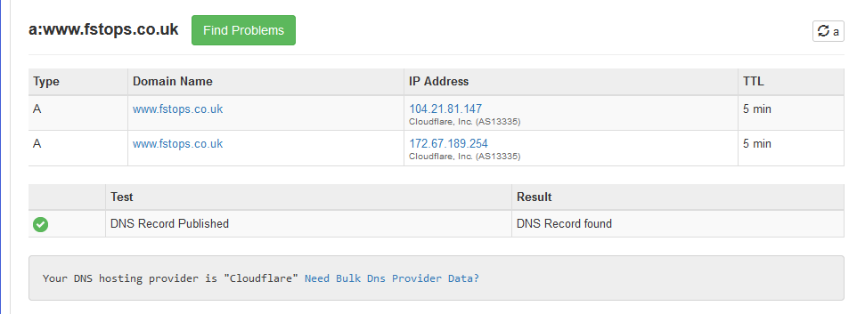
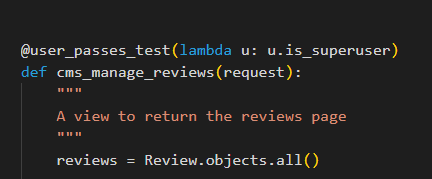
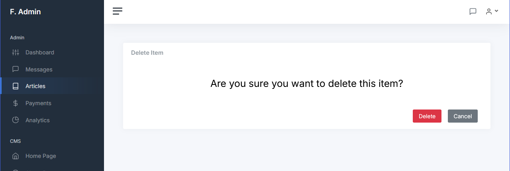

# FStops Comprehensive Testing

- [Defensive Programming](#defensive-programming)
- [Automated Testing](#automated-testing)
  - [HTML Validation](#html-validation)
  - [CSS Validation](#css-validation)
  - [JavaScript Validation](#javascript-validation)
  - [Python Validation](#python-validation)
  - [Lighthouse Report](#lighthouse-report)
    - [Desktop](#desktop)
    - [Mobile](#mobile)
  - [SEO Implementations](#seo-implementations)
  - [WAVE Web Accessibility](#wave-web-accessibility)
  - [Django Automated Testing](#django-automated-testing)
  - [Cypress End to End Testing](#cypress-end-to-end-testing)
  - [Favicon](#favicon)
  - [Navigation](#navigation)
- [Manual Testing](#manual-testing)
  - [Accessibility](#accessibility)
  - [User Stories](#user-stories)
  - [Responsiveness](#responsiveness)
  - [Full Testing](#full-testing)
  - [Payment Processing](#payment-processing)
- [Bugs, Errors &amp; Solutions](#bugs-errors--solutions)
  - [Solved Bugs](#solved-bugs)
  - [Known Bugs](#known-bugs)

## Defensive Programming



- [MXToolbox](https://mxtoolbox.com/SuperTool.aspx?action=a%3a&run=toolpage)

One of the most significant things I implemented to protect the site was to set up Cloudflare as the Primary DNS provider. This provides a number of benefits:

- DDoS Protection - Cloudflare filters all network traffic through it's own network in order to detect and block malicious traffic
- Firewall and Bot Management - Cloudflare provides a Web Application Firewall further filtering malicious web traffic and blocking common threats like SQL injection and cross site scripting
- Global CDN - Cloudflare caches the website content across its global CDN improving the performance and load times across the entire site by serving the content from a server closer to the end user.
- DNSSEC - Domain Name System Security Extensions add a further layer of protection ensuring that DNS records cannot be tampered with, preventing things like DNS spoofing or cache poisoning
- Automatic Threat Detection - Cloudflare analyses all traffic in realtime globally across its DNS network to identify threats and block traffic proactively

Source: [Cloudflare](https://www.cloudflare.com/en-gb/application-services/products/dns/)

In addition to this, I have prevented unauthorised users from visiting pages they should not have access to by using the built in ```@user_passes_test``` and ```@login_required``` decorators available by default within Django.



Another example is my use of confirmation prompts when a superuser attempts to delete an item from the database, the use of this confirmation prompt helps to ensure the user hasn't misclicked on the delete button by requiring a second level of intention before permanently deleting anything.



In future, however, I would like to change the way deletion works. Ideally nothing would ever be deleted and would instead be flagged or archived and then live data would be filtered based on this flag.

This way, when something is "deleted" it can always be recovered as accidental deletion of items is inevitable regardless of how many prompts you put in the way. Another way to resolve this would be to implement back ups of the database on a regular basis, which should be implemented anyway on a live/production system.

## Accessibility

In order to comply with accessibility requirements I have wherever possible implemented best practices in order to improve the ease of use of the website for individuals with accessibility needs by implementing the following:

- Semantic HTML
- Descriptive alt attributes
- Providing appropriate ARIA attributes wherever necassary
- Ensuring sufficient colour contrast
- Using webp instead of jpeg images across the site

In order to ensure I have not missed anything I used a number of tools to validate the accessibility of this website which will be covered in reater depth further into this document.

## Automated Testing

### HTML Validation


### CSS Validation

I chose to implement a fairly new feature of CSS called CSS Nesting. This allows me to make my CSS stylesheets more modular, more maintainable and easier to read. CSS Nesting has an 87% compatibility across all browsers and 100% compatibility across the 4 major browsers - Edge, Chrome, Firefox and Safari. [Source](https://caniuse.com/css-nesting)

CSS Nesting is different from using a preprocessor as it is correctly parsed by the browser itself rather than needing to be precompiled by a CSS preprocessor. [Source](https://developer.mozilla.org/en-US/docs/Web/CSS/CSS_nesting/Using_CSS_nesting#invalid_nested_style_rules)

However, one downside to this is that the major automated CSS testing software such as the W3C validator does not test correctly for nested CSS resulting in false positives for errors and warnings.

For this reason I chose to use [Stylelint](https://stylelint.io/demo/) for my CSS Validation.

One downside of Stylelint is that the program is uneccassarily strict in terms of CSS specificity. For example, if I were to have 2 different nested styling rules for a span, each with a different parent class but the span in the first nest has a higher specificity selection, Stylelint will throw an error, despite it being perfectly valid.

To resolve this I am running the tests with the following command to disable this rule:

```
/* stylelint-disable no-descending-specificity */
// styles
/* stylelint-enable no-descending-specificity */
```

Results:

| File                                               | Result   |
|----------------------------------------------------|----------|
| blog/static/css/blog-css.css                       | 0 Errors |
| home/static/home/home-style.css                    | 0 Errors |
| portfolio/static/portfolio/css/portfolio-style.css | 0 Errors |
| profiles/static/css/payment-css.css                | 0 Errors |
| service/static/services/css/services.css           | 0 Errors |
| static/css/control-panel.css                       | 0 Errors |
| static/css/style.css                               | 0 Errors |

CSS files that came as part of exteneral packages used (and credited in the main readme) were not tested.

### JavaScript Validation

In order to validate my JavaScript and ensure there are no bugs I will use [JSHint](https://jshint.com/) to supplement my manual testing of all functionality dependant on the JavaScript code I have written.

| File                                               | Result   | Screenshot |
|----------------------------------------------------|----------|------------|
| profiles/static/js/stripe_elements.js              | 2 Errors | [Screenshot](docs/testing/js-hint-stripe.png) |
| static/js/ga-consent.js                            | 1 Errors | [Screenshot](docs/testing/ga-consent.png) |
| static/js/gallery.js                               | 0 Errors | [Screenshot](docs/testing/gallery.png) |

The only errors found were related to global variables defined outside of the file, for this reason, they will be ignored as I am confident that they are not an issue after manually testing.

### Python Validation

For validation of my Python code I will be using Code Institutes PEP8 Python Linter [here.](https://pep8ci.herokuapp.com/)

| File                | Result         | Screenshot |
|---------------------|----------------|------------|
| fstop/settings.py   | 0 Errors       | [Screenshot](docs/testing/python/blog_views.png) |
| fstop/urls.py       | 0 Errors       | [Screenshot](docs/testing/python/blog_views.png) |
| custom_storages.py  | 0 Errors       | [Screenshot](docs/testing/python/custom_storages.png) |
| **Blog App**        |                |            |
| views.py            | 0 Errors       | [Screenshot](docs/testing/python/blog_views.png) |
| urls.py             | 0 Errors       | [Screenshot](docs/testing/python/no-errors.png) |
| tests.py            | 0 Errors       | [Screenshot](docs/testing/python/no-errors.png) |
| models.py           | 0 Errors       | [Screenshot](docs/testing/python/no-errors.png) |
| **controlpanel**    |                |            |
|   |   |   |
|   |   |   |
|   |   |   |
|   |   |   |
|   |   |   |
|   |   |   |
|   |   |   |
|   |   |   |
|   |   |   |
|   |   |   |
|   |   |   |
|   |   |   |
|   |   |   |
|   |   |   |
|   |   |   |
|   |   |   |
|   |   |   |
|   |   |   |
|   |   |   |
|   |   |   |

### Lighthouse Report
#### Desktop
#### Mobile
### SEO Implementations
### WAVE Web Accessibility
### Django Automated Testing
### Cypress End to End Testing
### Favicon
### Navigation
## Manual Testing
### User Stories
### Responsiveness
### Full Testing
### Payment Processing
## Bugs, Errors &amp; Solutions
### Solved Bugs
### Known Bugs


