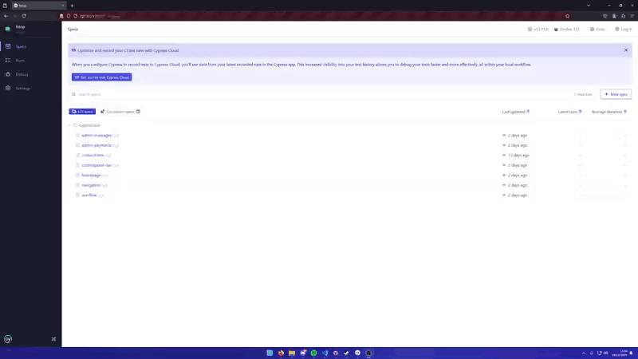
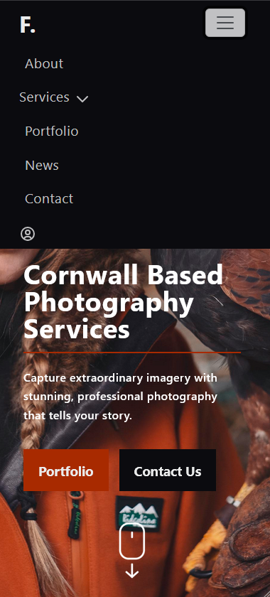
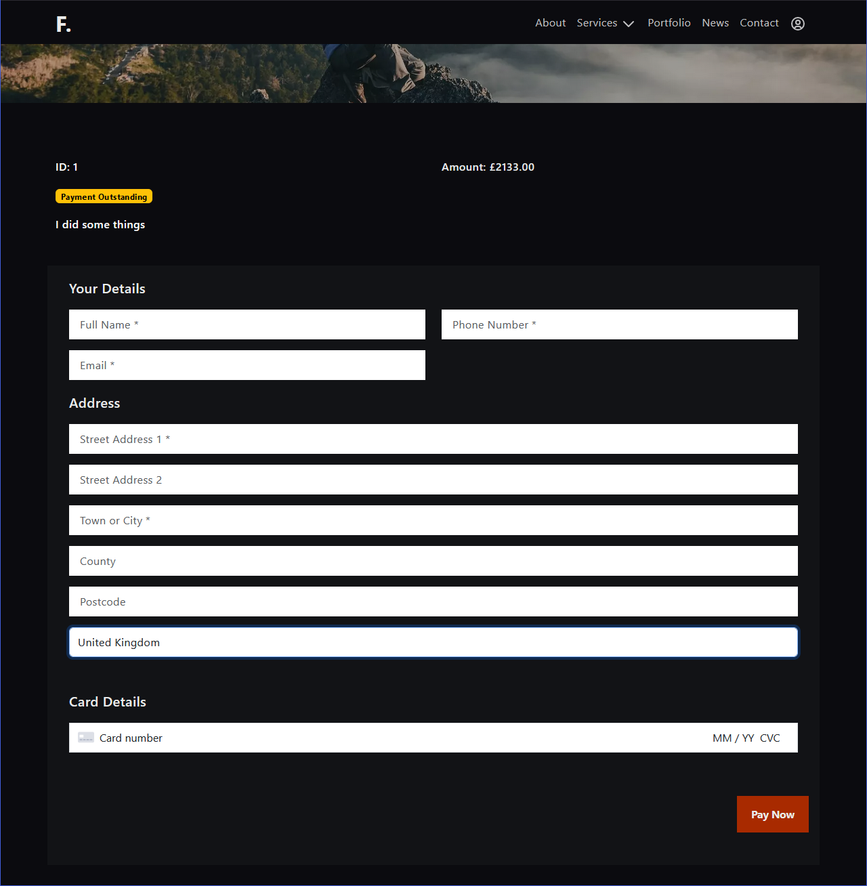

# FStops Comprehensive Testing

- [Defensive Programming](#defensive-programming)
- [Automated Testing](#automated-testing)
  - [HTML Validation](#html-validation)
  - [CSS Validation](#css-validation)
  - [JavaScript Validation](#javascript-validation)
  - [Python Validation](#python-validation)
  - [Lighthouse Report](#lighthouse-report)
    - [Desktop](#desktop)
    - [Mobile](#mobile)
  - [SEO Implementations](#seo-implementations)
  - [WAVE Web Accessibility](#wave-web-accessibility)
  - [Django Automated Testing](#django-automated-testing)
  - [Cypress End to End Testing](#cypress-end-to-end-testing)
  - [Favicon](#favicon)
  - [Navigation](#navigation)
- [Manual Testing](#manual-testing)
  - [Accessibility](#accessibility)
  - [User Stories](#user-stories)
  - [Responsiveness](#responsiveness)
  - [Full Testing](#full-testing)
  - [Payment Processing](#payment-processing)
- [Bugs, Errors &amp; Solutions](#bugs-errors--solutions)
  - [Solved Bugs](#solved-bugs)
  - [Known Bugs](#known-bugs)

## Defensive Programming


- [MXToolbox](https://mxtoolbox.com/SuperTool.aspx?action=a%3a&run=toolpage)

One of the most significant things I implemented to protect the site was to set up Cloudflare as the Primary DNS provider. This provides a number of benefits:

- DDoS Protection - Cloudflare filters all network traffic through it's own network in order to detect and block malicious traffic
- Firewall and Bot Management - Cloudflare provides a Web Application Firewall further filtering malicious web traffic and blocking common threats like SQL injection and cross site scripting
- Global CDN - Cloudflare caches the website content across its global CDN improving the performance and load times across the entire site by serving the content from a server closer to the end user.
- DNSSEC - Domain Name System Security Extensions add a further layer of protection ensuring that DNS records cannot be tampered with, preventing things like DNS spoofing or cache poisoning
- Automatic Threat Detection - Cloudflare analyses all traffic in realtime globally across its DNS network to identify threats and block traffic proactively

Source: [Cloudflare](https://www.cloudflare.com/en-gb/application-services/products/dns/)

In addition to this, I have prevented unauthorised users from visiting pages they should not have access to by using the built in ```@user_passes_test``` and ```@login_required``` decorators available by default within Django.


Another example is my use of confirmation prompts when a superuser attempts to delete an item from the database, the use of this confirmation prompt helps to ensure the user hasn't misclicked on the delete button by requiring a second level of intention before permanently deleting anything.


In future, however, I would like to change the way deletion works. Ideally nothing would ever be deleted and would instead be flagged or archived and then live data would be filtered based on this flag.

This way, when something is "deleted" it can always be recovered as accidental deletion of items is inevitable regardless of how many prompts you put in the way. Another way to resolve this would be to implement back ups of the database on a regular basis, which should be implemented anyway on a live/production system.

## Accessibility

In order to comply with accessibility requirements I have wherever possible implemented best practices in order to improve the ease of use of the website for individuals with accessibility needs by implementing the following:

- Semantic HTML
- Descriptive alt attributes
- Providing appropriate ARIA attributes wherever necassary
- Ensuring sufficient colour contrast
- Using webp instead of jpeg images across the site

In order to ensure I have not missed anything I used a number of tools to validate the accessibility of this website which will be covered in reater depth further into this document.

## Automated Testing

### HTML Validation

| Page               | Errors   | Result     |
|--------------------|----------|------------|
| Index              | 0 Errors | [W3C Result](https://validator.w3.org/nu/?doc=https%3A%2F%2Fwww.fstops.co.uk%2F) |
| About              | 0 Errors | [W3C Result](https://validator.w3.org/nu/?doc=https%3A%2F%2Fwww.fstops.co.uk%2Fabout) |
| Services/Lifestyle | 0 Errors | [W3C Result](https://validator.w3.org/nu/?doc=https%3A%2F%2Fwww.fstops.co.uk%2Fservices%2Flifestyle%2F) |
| Services/Event     | 0 Errors | [W3C Result](https://validator.w3.org/nu/?doc=https%3A%2F%2Fwww.fstops.co.uk%2Fservices%2Fevent%2F) |
| Services/Property  | 0 Errors | [W3C Result](https://validator.w3.org/nu/?doc=https%3A%2F%2Fwww.fstops.co.uk%2Fservices%2Fproperty%2F) |
| Services/Aerial    | 0 Errors | [W3C Result](https://validator.w3.org/nu/?doc=https%3A%2F%2Fwww.fstops.co.uk%2Fservices%2Faerial%2F) |
| Portfolio          | 0 Errors | [W3C Result](https://validator.w3.org/nu/?doc=https%3A%2F%2Fwww.fstops.co.uk%2Fportfolio%2F) |
| News               | 0 Errors | [W3C Result](https://validator.w3.org/nu/?doc=https%3A%2F%2Fwww.fstops.co.uk%2Fnews%2F) |
| Article            | 0 Errors | [W3C Result](https://validator.w3.org/nu/?doc=https%3A%2F%2Fwww.fstops.co.uk%2Fnews%2Funderstanding-the-f-stop%2F) |
| Contact            | 0 Errors | [W3C Result](https://validator.w3.org/nu/?doc=https%3A%2F%2Fwww.fstops.co.uk%2Fcontact%2F) |

All custom error pages (404,400,500 etc.) were also manually tested by inserting the raw HTML into the test manually. Each returned 0 errors.

### CSS Validation

I chose to implement a fairly new feature of CSS called CSS Nesting. This allows me to make my CSS stylesheets more modular, more maintainable and easier to read. CSS Nesting has an 87% compatibility across all browsers and 100% compatibility across the 4 major browsers - Edge, Chrome, Firefox and Safari. [Source](https://caniuse.com/css-nesting)

CSS Nesting is different from using a preprocessor as it is correctly parsed by the browser itself rather than needing to be precompiled by a CSS preprocessor. [Source](https://developer.mozilla.org/en-US/docs/Web/CSS/CSS_nesting/Using_CSS_nesting#invalid_nested_style_rules)

However, one downside to this is that the major automated CSS testing software such as the W3C validator does not test correctly for nested CSS resulting in false positives for errors and warnings.

For this reason I chose to use [Stylelint](https://stylelint.io/demo/) for my CSS Validation.

One downside of Stylelint is that the program is uneccassarily strict in terms of CSS specificity. For example, if I were to have 2 different nested styling rules for a span, each with a different parent class but the span in the first nest has a higher specificity selection, Stylelint will throw an error, despite it being perfectly valid.

To resolve this I am running the tests with the following command to disable this rule:

```
/* stylelint-disable no-descending-specificity */
// styles
/* stylelint-enable no-descending-specificity */
```

Results:

| File                                               | Result   |
|----------------------------------------------------|----------|
| blog/static/css/blog-css.css                       | 0 Errors |
| home/static/home/home-style.css                    | 0 Errors |
| portfolio/static/portfolio/css/portfolio-style.css | 0 Errors |
| profiles/static/css/payment-css.css                | 0 Errors |
| service/static/services/css/services.css           | 0 Errors |
| static/css/control-panel.css                       | 0 Errors |
| static/css/style.css                               | 0 Errors |

CSS files that came as part of exteneral packages used (and credited in the main readme) were not tested.

### JavaScript Validation

In order to validate my JavaScript and ensure there are no bugs I will use [JSHint](https://jshint.com/) to supplement my manual testing of all functionality dependant on the JavaScript code I have written.

| File                                               | Result   | Screenshot |
|----------------------------------------------------|----------|------------|
| profiles/static/js/stripe_elements.js              | 2 Errors | [Screenshot](docs/testing/js-hint-stripe.png) |
| static/js/ga-consent.js                            | 1 Errors | [Screenshot](docs/testing/ga-consent.png) |
| static/js/gallery.js                               | 0 Errors | [Screenshot](docs/testing/gallery.png) |

The only errors found were related to global variables defined outside of the file, for this reason, they will be ignored as I am confident that they are not an issue after manually testing.

### Python Validation

For validation of my Python code I will be using Code Institutes PEP8 Python Linter [here.](https://pep8ci.herokuapp.com/)

| File                | Result         | Screenshot |
|---------------------|----------------|------------|
| fstop/settings.py   | 0 Errors       | [Screenshot](docs/testing/python/blog_views.png) |
| fstop/urls.py       | 0 Errors       | [Screenshot](docs/testing/python/blog_views.png) |
| custom_storages.py  | 0 Errors       | [Screenshot](docs/testing/python/custom_storages.png) |
| **blog**            |                |            |
| views.py            | 0 Errors       | [Screenshot](docs/testing/python/blog_views.png) |
| urls.py             | 0 Errors       | [Screenshot](docs/testing/python/no-errors.png) |
| tests.py            | 0 Errors       | [Screenshot](docs/testing/python/no-errors.png) |
| models.py           | 0 Errors       | [Screenshot](docs/testing/python/no-errors.png) |
| **controlpanel**    |                |            |
| views/*.py          | 0 Errors       | [Screenshot](docs/testing/python/no-errors.png) |
| forms.py            | 0 Errors       | [Screenshot](docs/testing/python/no-errors.png) |
| models.py           | 0 Errors       | [Screenshot](docs/testing/python/no-errors.png) |
| tests.py            | 0 Errors       | [Screenshot](docs/testing/python/no-errors.png) |
| urls.py             | 0 Errors       | [Screenshot](docs/testing/python/no-errors.png) |
| apps.py             | 0 Errors       | [Screenshot](docs/testing/python/no-errors.png) |
| **home**            |                |            |
| views.py            | 0 Errors       | [Screenshot](docs/testing/python/no-errors.png) |
| forms.py            | 0 Errors       | [Screenshot](docs/testing/python/no-errors.png) |
| models.py           | 0 Errors       | [Screenshot](docs/testing/python/no-errors.png) |
| tests.py            | 0 Errors       | [Screenshot](docs/testing/python/no-errors.png) |
| urls.py             | 0 Errors       | [Screenshot](docs/testing/python/no-errors.png) |
| apps.py             | 0 Errors       | [Screenshot](docs/testing/python/no-errors.png) |
| **payments**        |                |            |
| views.py            | 0 Errors       | [Screenshot](docs/testing/python/no-errors.png) |
| forms.py            | 0 Errors       | [Screenshot](docs/testing/python/no-errors.png) |
| models.py           | 0 Errors       | [Screenshot](docs/testing/python/no-errors.png) |
| tests.py            | 0 Errors       | [Screenshot](docs/testing/python/no-errors.png) |
| urls.py             | 0 Errors       | [Screenshot](docs/testing/python/no-errors.png) |
| apps.py             | 0 Errors       | [Screenshot](docs/testing/python/no-errors.png) |
| **portfolio**       |                |            |
| views.py            | 0 Errors       | [Screenshot](docs/testing/python/no-errors.png) |
| forms.py            | 0 Errors       | [Screenshot](docs/testing/python/no-errors.png) |
| models.py           | 0 Errors       | [Screenshot](docs/testing/python/no-errors.png) |
| tests.py            | 0 Errors       | [Screenshot](docs/testing/python/no-errors.png) |
| urls.py             | 0 Errors       | [Screenshot](docs/testing/python/no-errors.png) |
| apps.py             | 0 Errors       | [Screenshot](docs/testing/python/no-errors.png) |
| **profiles**        |                |            |
| views.py            | 0 Errors       | [Screenshot](docs/testing/python/no-errors.png) |
| forms.py            | 0 Errors       | [Screenshot](docs/testing/python/no-errors.png) |
| models.py           | 0 Errors       | [Screenshot](docs/testing/python/no-errors.png) |
| tests.py            | 0 Errors       | [Screenshot](docs/testing/python/no-errors.png) |
| urls.py             | 0 Errors       | [Screenshot](docs/testing/python/no-errors.png) |
| apps.py             | 0 Errors       | [Screenshot](docs/testing/python/no-errors.png) |
| webhooks.py         | 0 Errors       | [Screenshot](docs/testing/python/no-errors.png) |
| webhook_handler.py  | 0 Errors       | [Screenshot](docs/testing/python/no-errors.png) |
| **reviews**         |                |            |
| views.py            | 0 Errors       | [Screenshot](docs/testing/python/no-errors.png) |
| forms.py            | 0 Errors       | [Screenshot](docs/testing/python/no-errors.png) |
| models.py           | 0 Errors       | [Screenshot](docs/testing/python/no-errors.png) |
| tests.py            | 0 Errors       | [Screenshot](docs/testing/python/no-errors.png) |
| urls.py             | 0 Errors       | [Screenshot](docs/testing/python/no-errors.png) |
| apps.py             | 0 Errors       | [Screenshot](docs/testing/python/no-errors.png) |
| webhooks.py         | 0 Errors       | [Screenshot](docs/testing/python/no-errors.png) |
| webhook_handler.py  | 0 Errors       | [Screenshot](docs/testing/python/no-errors.png) |
| **service**         |                |            |
| views.py            | 0 Errors       | [Screenshot](docs/testing/python/no-errors.png) |
| forms.py            | 0 Errors       | [Screenshot](docs/testing/python/no-errors.png) |
| models.py           | 0 Errors       | [Screenshot](docs/testing/python/no-errors.png) |
| tests.py            | 0 Errors       | [Screenshot](docs/testing/python/no-errors.png) |
| urls.py             | 0 Errors       | [Screenshot](docs/testing/python/no-errors.png) |
| apps.py             | 0 Errors       | [Screenshot](docs/testing/python/no-errors.png) |
| webhooks.py         | 0 Errors       | [Screenshot](docs/testing/python/no-errors.png) |
| webhook_handler.py  | 0 Errors       | [Screenshot](docs/testing/python/no-errors.png) |

### Lighthouse Report
#### Desktop

**Home**


**About**


**Service Page**


**Portfolio Page**


**News Page**


**Article Page**


**Contact Page**


#### Mobile

**Home**


**About**


**Service Page**


**Portfolio Page**


**News Page**


**Article Page**


**Contact Page**


##### Conclusion

There are a number of factors at play here and while the overall scores here are decent I believe there is room for improvement. One notable example of something I could implement in future to improve the scores here is to implement Image Source Sets for various images across the site. Providing a number of image sources and allowing the browser to render the appropriate one based on the screen size would allow me to provide images at resolutions more accurate to the dimensions at which it would be displayed, allowing me to use smaller images with better aspect ratios and smaller filesizes for mobile devices, for example.

Another factor that I believe is having a significant impact on the score is the performance hit from Stripes JavaScript. I have bundles their JavaScript file with the base template HTML file, however after inspecting the network tab in my browsers dev tools, it appears that Stripe is still initiating activity sometimes more than 5 seconds into the page load. Further investigation would be required to analyse the true impact of this on the performance.


Ultimately though, I believe I have overall achieved good scores here, especially considering that as a website focused on photography it is naturally going to be relatively heavy in terms of media, likely one of the biggest factors affecting performance is going to be images and therefore this must be taken into account.

### SEO Implementations


Source: [SEObility](https://freetools.seobility.net)

SEO in and of itself is something that could have a while other readme file dedicated to it, however, I will give a breif overview of my goals and targets for this website and what I did to achieve those targets.

#### The Goal

Search Engine optimisation (SEO) is crucial for ensuring that a website ranks highly for specific search terms in search engines result pages (SERP's). A higher ranking in the results ensure a higher number of visitors which in turn creates more potential leads for revenue generation. In a bid to get the best possible google search ranking I implemented a number of methods and followed best practices as I will explain below.

#### In Practice

**Keyword Research &amp; Optimisation**

A number of keywords and phrases were chosen that FStops wanted to be ranked highly for. These keywords were then used predominantly in titles and descriptive text across the website. By identifying these relevant keywords to FStops Photography the content across the website could be optimised to naturally include these terms.

For these reason keywords and phrases such as "Professional Photography", "Wedding Photography" and others have been integrated into page titles and body text across the website as well as meta information.

**On Page SEO**

This is the practice of optimising individual pages so that crawler robots from major search engines are able to more easily understand an index them. This information includes title tags, meta descriptions and appropriae use of header titles amongst other things. Therefore, each page across the FStops website features bespoke title and description tages in the meta data. Additionally semantic HTML and appropriate title tags (h1, h2 etc...) were used to ensure content was structured and easy for both uers and crawlers to understand.

**Mobile Optimisation**

More and more users are now navigating the web using mobile devices and there is a general shift away from the use of Desktop computers at all for world wide web navigation. Down from 79% in 2013 to just 39% in 2024 ([Source](https://www.mobiloud.com/blog/what-percentage-of-internet-traffic-is-mobile)).

For this reason the website has been built with a responsive design at it's foundation ensuring a well structured and aesthetically beautiful layout across all devices and screensizes.

**Page Speed Optimisation**

Page load time is a significant factor for things like user retention and Bounce* rate. By reducing the amount of time the website takes to load you are significantly reducing the bounce rate of the wesbite. Additionally, Search Engines penalise websites that load slowly. I ahve employed a number of techniques to ensure the page load time is optimal including optimising images, minimising network requests, the use of a CDN network and compression of image files where possible. 

* Bounce Rate: The number of users who immediately leave a website after viewing only one page.

**Image Optimisation**

The website features a large number of images which can lead to a balloon in web page sizes if kept unchecked which would negatively impact SEO rankings. All images on the site have been compressed to minimise the file size and the image dimensions have been reduce to the size at which they will actually be displayed on the page. Additionally appropriate alt texts are provided with images to help search engines understand what the image is.

**Internal Linking**

Internal links help search engines understand and crawl the website as well as discover all available pages. Additionally this helps users navigate the website as well as distributing page authority and boosting the ranking potential of important pages. Across Fstops website I have provided a number of ways to navigate including a navigation menu and call-to-actions all with appropriate internal links guiding users to appropriate sections of the website.

**XML Sitemap and Robots.txt**

A properly configured sitemap and robots.txt file aid in ensuring that crawler robots from search engines fully understand the heirachy of the website. For this reason I have implemented a sitemap that updates with content generated by the blogging fucntionality I implemented on the site. This was done using [Django Sitemap Framework](https://docs.djangoproject.com/en/4.2/ref/contrib/sitemaps/). I have also added a properly configured robots.txt file to the root of the website.

**Secure Website**

Search engines prioritise websites who take basic security into consideration to protect the users. Using HTTPS is one of the easiest ways to help secure your website using SSL certificates. FStops Photography is secured with HTTPS, it not only helps protect the users data but also helps with SEO ranking.

**UX and Engagement**

Intuitive navigation and fast page load times are all taken into account by search engines and also benefit the users experience on the website. Additionally a design that encourages engagement helps keep visitors on the site longer. For this reason I have implemented a number of dynamic elements across the website with which suers can engage including the carousel Images with a parallax effect on the homepage and the image galleries on the portfolio and article pages.

**Analytics**

I have also added Google Analytics to the website. This helps identify popular pages and understanding audience behavior as well as tracking user engagement. This data can provide valuable insight and provide useful information for making data driven decisions.

By implementing these SEO best practices, the FStop Photography website is well-positioned to achieve higher rankings on search engines, improve user experience, and attract more organic traffic. This holistic approach ensures that the site is optimized for both search engines and human visitors, resulting in better performance and more engagement.

**Improvements**

The major issue identified by my SEO analysis of the website was a lack of external links to the website and a lack of social media. This are both things that will be improved but require time.

### WAVE Web Accessibility


The wave result shows no major issues, the one error that exists is dut to the Bootstrap Navbar I have implemented using an empty link to implement the drop down menu. Also, a couple of warnings about the ALT Text for various images which is easily resolved using the CMS.

### Django Automated Testing

I implemented a great amount of automated testing within the inbuilt django test functionality, however I did not aim to hit 100% coverage as more automated testing was done within Cypress to compnesate for that fact.

| Name                                                                       | Stmts | Miss | Cover |
|----------------------------------------------------------------------------|-------|------|-------|
| blog\models.py                                                             | 29    | 5    | 83%   |
| blog\urls.py                                                               | 3     | 0    | 100%  |
| blog\views.py                                                              | 12    | 8    | 33%   |
| controlpanel\models.py                                                     | 1     | 0    | 100%  |
| controlpanel\urls.py                                                       | 3     | 0    | 100%  |
| controlpanel\views\articles_views.py                                       | 60    | 42   | 30%   |
| controlpanel\views\cms_about_views.py                                      | 16    | 9    | 44%   |
| controlpanel\views\cms_homepage_views.py                                   | 166   | 122  | 27%   |
| controlpanel\views\cms_portfolio_views.py                                  | 34    | 21   | 38%   |
| controlpanel\views\cms_reviews_views.py                                    | 44    | 29   | 34%   |
| controlpanel\views\cms_services_views.py                                   | 52    | 37   | 29%   |
| controlpanel\views\dashboard_views.py                                      | 17    | 8    | 53%   |
| controlpanel\views\messages_views.py                                       | 49    | 34   | 31%   |
| controlpanel\views\payments_views.py                                       | 36    | 24   | 33%   |
| fstop\urls.py                                                              | 18    | 2    | 89%   |
| home\forms.py                                                              | 108   | 66   | 39%   |
| home\models.py                                                             | 98    | 20   | 80%   |
| home\urls.py                                                               | 3     | 0    | 100%  |
| home\views.py                                                              | 41    | 30   | 27%   |
| payments\forms.py                                                          | 19    | 11   | 42%   |
| payments\models.py                                                         | 31    | 6    | 81%   |
| payments\urls.py                                                           | 3     | 0    | 100%  |
| payments\views.py                                                          | 3     | 1    | 67%   |
| portfolio\models.py                                                        | 9     | 1    | 89%   |
| portfolio\urls.py                                                          | 3     | 0    | 100%  |
| portfolio\views.py                                                         | 7     | 0    | 100%  |
| profiles\forms.py                                                          | 20    | 12   | 40%   |
| profiles\models.py                                                         | 22    | 4    | 82%   |
| profiles\urls.py                                                           | 4     | 0    | 100%  |
| profiles\urls.py                                                           | 4     | 0    | 100%  |
| profiles\views.py                                                          | 69    | 49   | 29%   |
| profiles\webhook_handler.py                                                | 25    | 18   | 28%   |
| profiles\webhooks.py                                                       | 29    | 20   | 31%   |
| reviews\models.py                                                          | 9     | 1    | 89%   |
| service\forms.py                                                           | 17    | 10   | 41%   |
| service\models.py                                                          | 35    | 4    | 89%   |
| service\urls.py                                                            | 3     | 0    | 100%  |
| service\views.py                                                           | 25    | 17   | 32%   |
|----------------------------------------------------------------------------|-------|------|-------|
| TOTAL                                                                      | 1454  | 665  | 54%   |

Additionally, the tests themselves can be run by using the command:

```python manage.py test```

Resulting in the following output:


Specific tests can be run for individual apps within the project by using the command above suffixed with the app name. For example:

```python manage.py test blog```

### Cypress End to End Testing

In order to supplement my DJango Unit Tests I also implemented a variety of Cypress End to End Testing. A number of these tests can be seen below, however, you can run these tests yourself using Cpyress by cloning this repot (instructions [here](DEPLOYMENT.md)).

Once the project is cloned and set up, while you have the project running locally run the command ```npx cypress open``` and follow the intructions to set up Cypress locally. Then select End to End testing in a browser of your choice using the Cypress GUI then you can find the existing tests in the test environment that Cypress launches.

- Some tests require a superuser accounts login credentials. I created a superuser account in my local SQLite3 database for this purpose. Simply edit the login credentials provided in the .cy.js scripts (./cypress/e2e) with your own.

Alternatively create a local superuser with the following credentials:

username: testAdmin
password: testPassword123

NOTE: It is important not to create this account in the production database.





## Manual Testing
### User Stories

In order to demonstrate how the project solves each of the user stories identified in the original ReadMe document, I will evidence the user flow that satsifies each of the criteria below:

- Navigate around the site easily and intuitively

In order to satisfy this criteria on the FStops website, I have implemented a navigation system that is well Structured, responsive and intuitive. With the main navigation positioned at the top of the screen on all pages, the user knows exactly where and how to find the navigation menu at all times. Additionally Sub Menus are logically grouped under relevant categories.


Additionally, the navigation menu adapts to screens of different sizes, on mobile the navigation menu condenses into a list only accessible via the hamburger menu at the top right of each page. This keeps the overall design of the website free of clutter on smaller screens and conforms to standard conventions and user expectations.



- View previous work

There are a number of ways in which the user is able to see examples of FStops Photography's previous work, wither by viewing the portfolio page or by navigating to the News page which is functionally the same as a blog, allowing the sites superusers to display examples of recent work alongside recent events and news.

Each article within the News section has a small gallery, allowing the author of the entry to add several images here for showcasing.


- Easily understand what FStop Photography offers, so that I can decide if the services meet my needs

The services and expertise of FStops Photography are prominently displayed around the site, including several sections on the homepage, the about page in particular is dedicated to the expertise of the site owner, the services pages contain detailed information about the services offered as well as the nNews section allowing the site owner to post additional information relating to this.

- Easily find contact information or a contact form, so that I can inquire about booking or ask questions.

A prominent link to the contact page is found within the navigation menu at the top of each page and almost every page has a dedicated call to action directing the user to the contact page to find the full contact information for the business.


Additionally, once the user has navigated to the Contact Page, they will find a contact form allowing them to submit a message to the business directly.


- Find engaging and/or informative content

There are a number of engaging elements on the website, ranging from the parallax image slider on the homepage...


and also the interactive images within the portfolio and article pages, allowing the user to click on an image to see a new window animate into view displaying the image in a larger format.

On the Portfolio page, when the user does this, it also contains additional information about the image and on the article page there is additional information within the article itself.

- Read testimonials from previous clients, so that I can feel confident in the photographer's abilities

The homepage includes an animated testimonials section, this not only allows the user to see feedback from previous clients but also allows the website owner to add, delete and edit existing testimonials with a no code solution provided by the bespoke CMS.


- Learn about the photographer’s background and experience, so that I can feel more personally connected and trust their expertise

Through a combination of telling the businesses story through the about page, an overview of their abilities via the various services pages and the blogging functionality. I believe I have more than covered this criteria.

- Access the website on my mobile device with no issues, so that I can have a smooth experience regardless of the device I’m using

With a mobile first design I have ensured that the website looks beautiful on any device and screensize. This is done primarily through the use of media queries and with the help of the built in functionality provided via the Bootstrap CSS framework.


- View and read the photographer’s blog posts, so that I can learn more about their creative process and photography tips

The news section of the website allows the business to add content to the website with a no code solution provided by the bespoke CMS. This provides the end user with fresh and up to date content every time they visit the website. Allowing them to learn more about the business on each visit.

- I want the website to load quickly and function properly, so that I can have a positive browsing experience without frustration

As evidenced by the Lighthouse Test Scores and the comprehensive automated and manual testing done during development we can be certain that the website is fast, responsive and performs well.

- Register an account

Using the AllAuth plugin, this feature was easily implemented. Allowing anonymous users functionality to register, log in and manage their profile.

As a returning visitor I want to:

- Easily navigate to new portfolio updates, so that I can quickly view any recent work or projects

The portfolio section is almost an image dump of any images the business has added to that section using the bespoke CMS. It is up to the business how many and in what order they would like this information to be displayed. However, whenever the user visits this section they will see the latest content the business has added to it.

In future I would like to added a more comprehensive management system to this section of the website, allowing better control and guidelines for the site owner/admin to manage the content here to optimise performance of the page as well as present it in a more organised fashion for the end user.

- Quickly find any new blog posts, so that I can stay informed about the photographer’s latest tips, experiences, or insights

The blog feed on the homepage presents the user with the latest 2 blog posts from the news section of the website, allowing them to directly access the latest content. Additionally, the News section of the website features pagination with the content presented chronologically (Newest first) also allowing the user to go back through older content when desired.

- Log in so that I can view past projects, proofs, or completed work

The user is able to login thanks to functionality provided by integrating AllAuth into the website. This allows the user to register and log in, additionally functionality was then added to allow the user to view and manage all completed and outstanding projects within this area.

- Easily find the photographer’s contact information again, so that I can reach out quickly for any new inquiries or bookings

The contact information for the business will be easily accessible at all times on the contact page.


- View any new testimonials or client reviews, so that I can continue to gauge the photographer’s reputation and work quality

New testimonials can be added by the business through the bespoke CMS provided. Once new information is added here it will be displayed on the front end of the website for the end user to view.

- Pay any payment requests sent to me by FStops Photography

Functionality view and pay outstanding invoices was added in the users profile section. Allowing them to see information relating to the project and any outstanding amounts. The client is then able to pay this amount using Stripe which was seemlessly integrated into the website to allow the user to pay the outstanding amount without leaving the website.



As a Superuser of the site I want to:

- Easily update my portfolio with new images, so that I can showcase my latest work to potential clients
- Post new blog content, so that I can share my photography tips, creative process, or behind-the-scenes insights with my audience
- Track website traffic and visitor behavior through analytics, so that I can understand how users engage with my site and optimize their experience
- Be notified when a visitor submits a contact form inquiry, so that I can respond to potential clients in a timely manner
- Manage testimonials and reviews on my site, so that I can showcase positive feedback and build trust with new visitors
- Ensure that the website performs well on both desktop and mobile devices, so that all users have a smooth experience regardless of the device they’re using
- Ensure the website is secure, so that my clients' data is protected
- Be able to generate invoices and have them be paid by the client through the clients profile area of the website

### Responsiveness

In order to ensure compatibility amongst all major devices and browsers I tested the site using mobile phones, tablets and a variety of screen sizes as well as FireFox, Chrome, and Edge. Unfortunately I do not have access to a desktop version of Safari so I was unable to test specifically for this.

| Page            | Device/Desktop Dimension | Result         |
|-----------------|--------------------------|----------------|
| Home            |                          |                |
|                 | Mobile                   | [Screenshot](docs/responsiveness/iphone-11-home.png) |
|                 | Tablet                   | [Screenshot](docs/responsiveness/home-tablet.png) |
|                 | 1280x1024                | [Screenshot]() |
|                 | 1440x900                 | [Screenshot]() |
|                 | 1920x1080                | [Screenshot]() |
| About           |                          |                |
|                 | Mobile                   | [Screenshot](docs/responsiveness/iphone-11-about.png) |
|                 | Tablet                   | [Screenshot](docs/responsiveness/about-tablet.png) |
|                 | 1280x1024                | [Screenshot]() |
|                 | 1440x900                 | [Screenshot]() |
|                 | 1920x1080                | [Screenshot]() |
| Lifestyle       |                          |                |
|                 | Mobile                   | [Screenshot](docs/responsiveness/iphone-11-lifestyle.png) |
|                 | Tablet                   | [Screenshot](docs/responsiveness/lifestyle-tablet.png) |
|                 | 1280x1024                | [Screenshot]() |
|                 | 1440x900                 | [Screenshot]() |
|                 | 1920x1080                | [Screenshot]() |
| Portfolio       |                          |                |
|                 | Mobile                   | [Screenshot]() |
|                 | Tablet                   | [Screenshot]() |
|                 | 1280x1024                | [Screenshot]() |
|                 | 1440x900                 | [Screenshot]() |
|                 | 1920x1080                | [Screenshot]() |
| News            |                          |                |
|                 | Mobile                   | [Screenshot](docs/responsiveness/iphone-11-news.png) |
|                 | Tablet                   | [Screenshot]() |
|                 | 1280x1024                | [Screenshot]() |
|                 | 1440x900                 | [Screenshot]() |
|                 | 1920x1080                | [Screenshot]() |
| Article         |                          |                |
|                 | Mobile                   | [Screenshot]() |
|                 | Tablet                   | [Screenshot]() |
|                 | 1280x1024                | [Screenshot]() |
|                 | 1440x900                 | [Screenshot]() |
|                 | 1920x1080                | [Screenshot]() |
| Contact         |                          |                |
|                 | Mobile                   | [Screenshot](docs/responsiveness/iphone-11-contact.png) |
|                 | Tablet                   | [Screenshot](docs/responsiveness/contact-tablet.png) |
|                 | 1280x1024                | [Screenshot]() |
|                 | 1440x900                 | [Screenshot]() |
|                 | 1920x1080                | [Screenshot]() |

### Full Testing


## Bugs, Errors &amp; Solutions
### Solved Bugs

| Issue | Description                                                                                                                                                                                                                                                                                                                                                                                                                                                                          | Solution                                                                                                                                                                                                                                                                                                                                                                 |
|-------|--------------------------------------------------------------------------------------------------------------------------------------------------------------------------------------------------------------------------------------------------------------------------------------------------------------------------------------------------------------------------------------------------------------------------------------------------------------------------------------|--------------------------------------------------------------------------------------------------------------------------------------------------------------------------------------------------------------------------------------------------------------------------------------------------------------------------------------------------------------------------|
| 1     | Initially, I had great difficulty connecting my Django App to use the S3 bucket on deploy to serve static files. Myself and several other students as well as a number of Alumni spent several hours investigating the issue. At one point even my mentor took a look. We investigated my policy set up, the groups and the user permissions among other things in the S3 bucket set up as well as my settings within the app itself with no luck in finding the cause of the issue. | After spending several days on this issue I decided to try a different version of Django. I was using version 5.1 but all the documentation I could find was referencing Django 4.2. I don't how the changes made between these 2 versions of django would influence the functionality here but after switching the version 4.2 of Django my S3 bucket worked perfectly. |
| 2     | An issue with Chrome prevented my Javascript from working for the consent banner within the Chrome browser. When using Chrome, if the user clicked the accept button on the banner that appears at the bottom of the page to give consent to use cookies, the cookie would not be set in their browser despite the banner disappearing.                                                                                                                                              | This turned out to be caused by a recent update in Chrome forcing the attribute ```sameSite``` to be required when setting cookies. Once I set this within the script, the issue was resolved.                                                                                                                                                                           |
| 3     | When validating my HTML, I found that the portfolio page and article page had an img with no src or alt value set. This was done intentionally as the functionality was for the image attributes to be set when the user clicks on an image gallery item. However, the accessibility issues this causes did not cross my mind at the time.                                                                                                                                           | In order to resolve this issue I simply set default values as placeholders for the required attributes                                                                                                                                                                                                                                                                   |
| 4     | A friend came across an error when using the delete functionality within the CMS on Slider Images, Portfolio Images and Messages. When using the delete functionality the suer was redirected to a 404 page but the item would still be deleted. This issue only occured in Chrome.                                                                                                                                                                                                  | A full explanation will be written below.                                                                                                                                                                                                                                                                                                                                |

- Delete functionality resulting in 404

Originally, when deleting an item from the database using the functionality provided within the CMS, the item would be deleted then the user redirected to a 404 page.

For the purpose of the explanation I was use the functionality to delete a Slider Image from the homepage Carousel as the example.

The view was a rather short piece of code, where upon confirmation deletion of the item the user would be referred to the "cp_cms_delete_slider_image" view. This view would then find the image in the database, delete it and redirect the user back to the main management page for all of the images relating to the homepage carousel.

```
@user_passes_test(lambda u: u.is_superuser)
def cp_cms_delete_slider_image(request, image_id):
    """
    A view to delete a slider image
    """
    image = get_object_or_404(HomePageSliderImages, id=image_id)
    image.delete()
    messages.success(request, "Carousel image deleted successfully")
    return redirect("cp_cms_manage_slider_images")
```

What seemed to actually be happening, and only in Chrome, was that upon confirming their intention to delete the item, the user was directed to the view above where it then fetched the item from the database, deleted it and then seemed to be trying to fetch the same item again but retuning a 404 as it, obviously, no longer existed. This resulted in the error:

```
Page not found (404)
No HomePageSliderImages matches the given query.
Request Method:	GET
Request URL:	127.0.0.1:8000/control-panel/homepage/carousel-images/86/delete/confirmed/
Raised by:	controlpanel.views.cms_homepage_views.cp_cms_delete_slider_image
```

I spent some time investigating this and could not find the root cause, I again called on the help of fellow students, alumni and my mentor, none of which were able to provide any insight. 
I tried to implement the use of try-except blocks to identify the issue or prevent it with no luck. Therefore in order to remove the issue I refactored the view to instead, find the image, delete it and show a confirmation page instead of redirecting. This solved the original issue.

### Known Bugs

There are no known bugs.